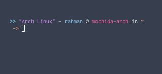

# zsh-themes

## Themes

### Mochi

Uses rust main function-themed prompt, displays your OS name

### Greeter

Greets you depends on local time

### Mochi 2

Basically Mochi but no rust-themed thingy

## Installation

Run sh install.sh and set the theme name in ~/.zshrc
