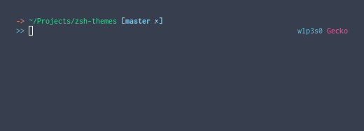

# zsh-themes

## Themes

### Mochi

Uses rust main function-themed prompt, displays your OS name

### Greeter

Greets you depends on local time

### Mochi 2

Basically Mochi but no rust-themed thingy

### Net

Shows your SSID

## Installation

Run sh install.sh and set the theme name in ~/.zshrc

## Disclaimer

These themes might be super suck. If you dont like them or thinking that changing something in the theme would make it better, just submit a pull request. You can modify them as you like
